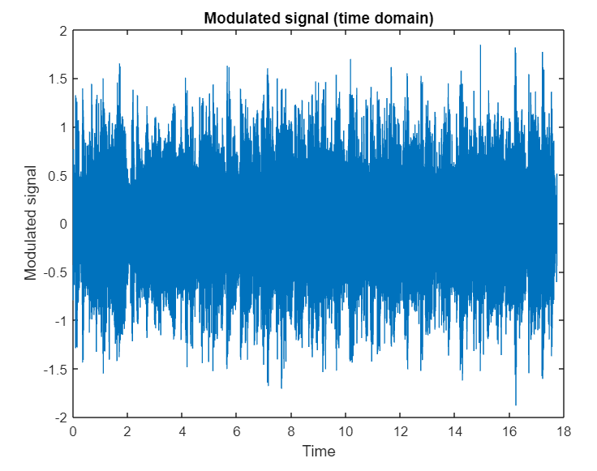
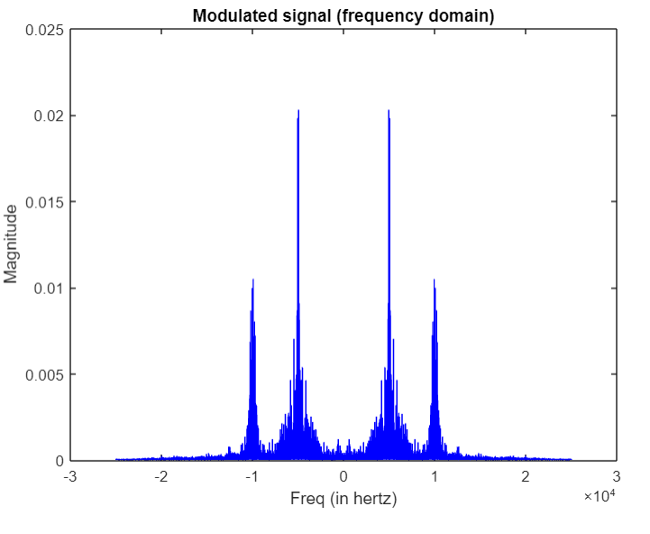

# SiGnAl

### About
SiGnAl is a project to modulate three speech signals using the following scheme: 𝑠(𝑡) = 𝑥1(𝑡) cos 𝜔1𝑡 + 𝑥2(𝑡) cos 𝜔2𝑡 + 𝑥3(𝑡) sin 𝜔2𝑡, and then perform synchronous demodulation.
### Modulated signal

### Demodulated signal with phase shift
- I apply demodulation with phase shift 10 ,30 &90. 
- demodulation with phase shift 10 ,30 doesnt affect the signal too much. 
- demodulation with phase shift 90 strongly affect the speech signal and it seems like No sound.
### Demodulated signal with frequency difference
- I apply demodulation with frequency difference 2 & 10 HZ.
- demodulation with 2 & 10 was very bad in result and the sound was not clear at all.
